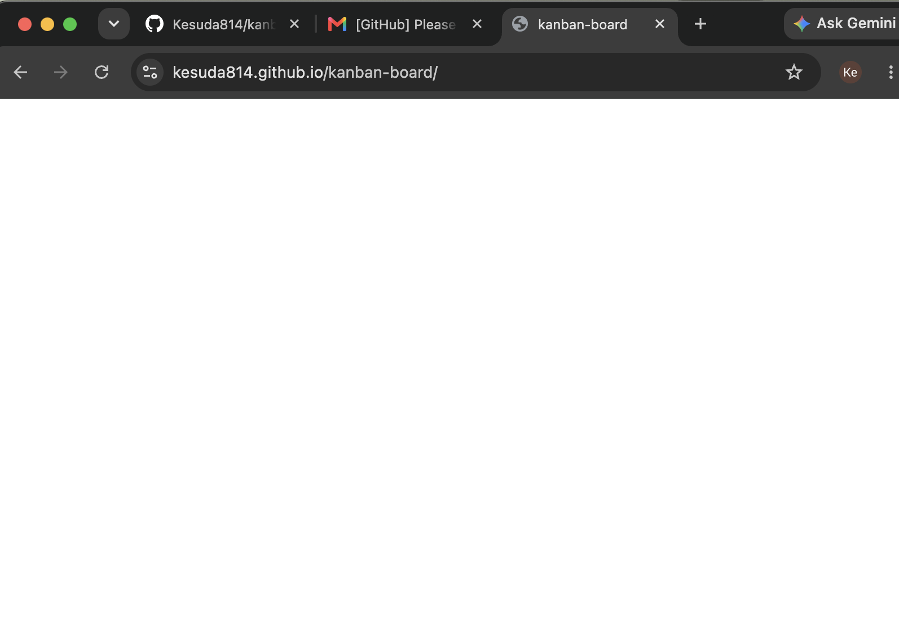
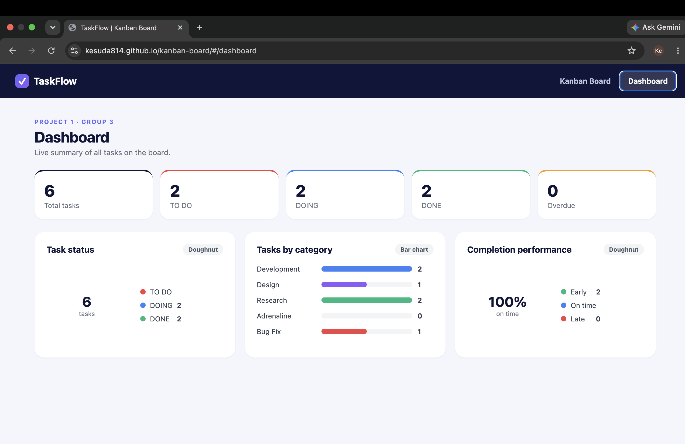

# Kanban Board with Dashboard

A **JavaScript (JSX)** Kanban task-management application with a 3-column board and a live analytics dashboard, backed by Local Storage (no backend). No TypeScript is used.

## Live demo

🔗 **GitHub Pages**: https://Kesuda814.github.io/kanban-board

## Features

### Kanban Board
- 3 columns: TO DO, DOING, DONE
- Create, edit, and delete tasks
- Move tasks between columns (drag & drop and the status dropdown)
- Assign a responsible person and a category to each task
- Start date, due date, and automatic complete date when a task is marked DONE
- Add new categories inline while editing a task
- Tasks and categories persist in Local Storage

### Dashboard
- Summary cards: total, TO DO, DOING, DONE, and overdue counts
- Task status doughnut chart
- Task category bar chart
- Completion performance doughnut (Early / On Time / Late)

## Team members

- Kesuda
- Thwe Hnin Eain
- Hein Nyan Swen

## Technologies

- React + Vite
- React Router (hash routing for GitHub Pages)
- Local Storage for persistence
- Plain CSS (no UI framework, no TypeScript)
- ESLint for linting

## Getting started

```bash
# 1. Clone the repository
git clone https://github.com/Kesuda814/kanban-board.git
cd kanban-board

# 2. Install dependencies
npm install

# 3. Start the development server
npm run dev

# 4. Open http://localhost:5173
```

## Linting

```bash
npm run lint        # run ESLint
npm run lint:fix    # run ESLint and auto-fix
```

### Deploy updates to GitHub Pages

```bash
npm run build
npm run deploy
```

## Screenshots



